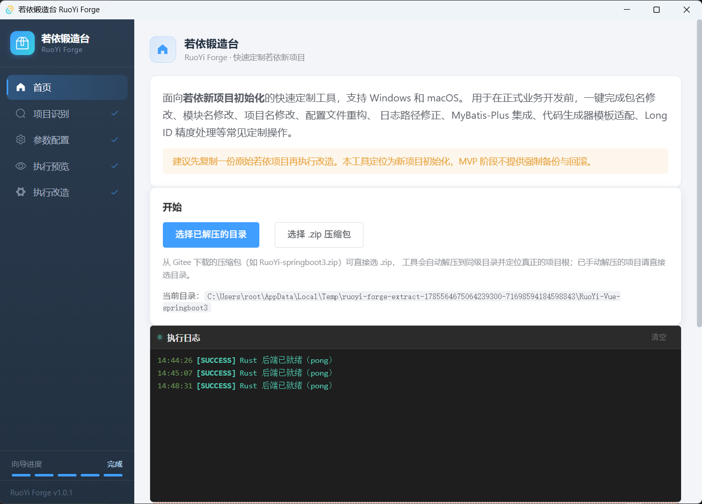
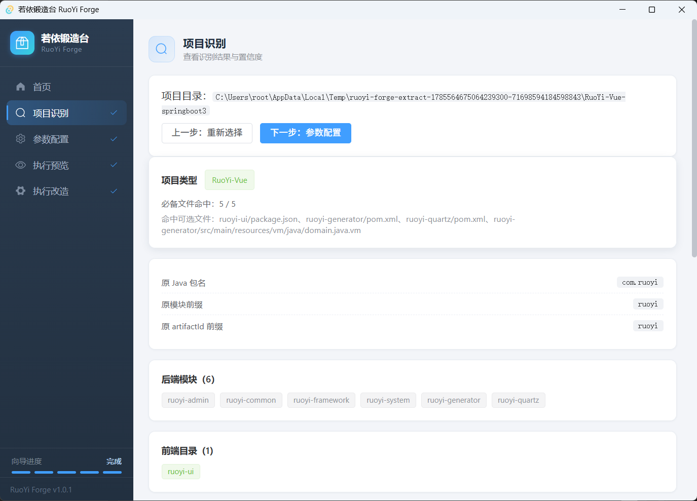
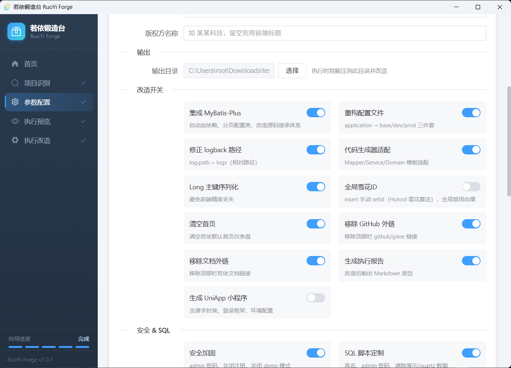
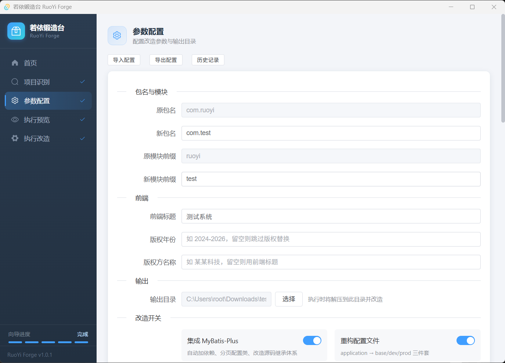
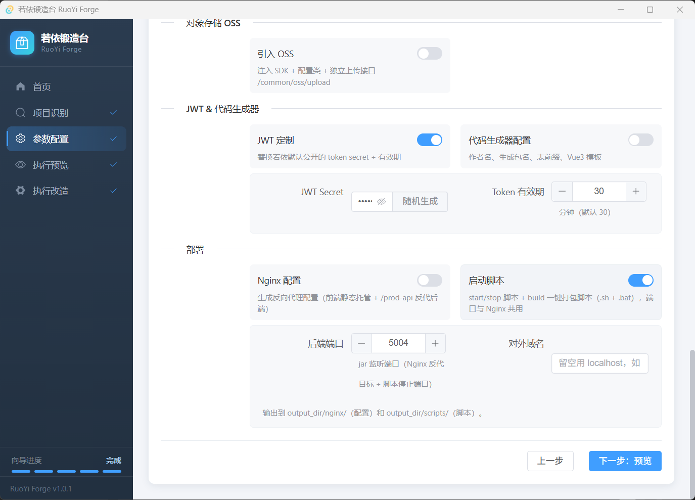
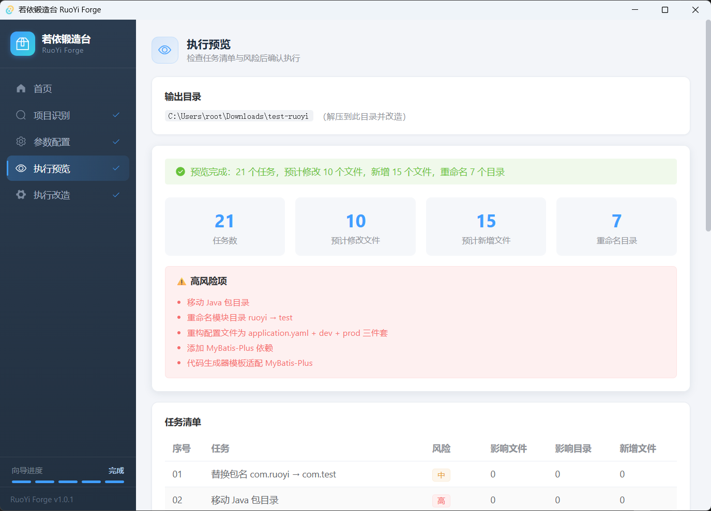
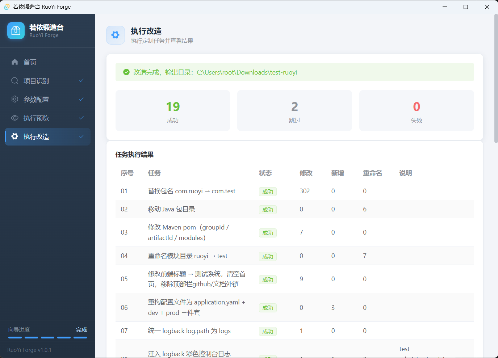

# 若依锻造台 RuoYi Forge

[English](README.en.md) | 中文

若依（RuoYi-Vue）新项目的快速初始化定制工具。一键完成包名修改、模块重命名、配置文件重构、MyBatis-Plus 集成、UniApp 小程序骨架生成等常见定制操作，告别重复劳动。

> 本项目基于 [GLM 5.2](https://zhipuai.cn) 协同开发。

---

## 功能特性

- **包名改造** — Java 包名全文替换 + 目录自动迁移
- **模块重命名** — 后端模块 + 前端目录统一按前缀替换（如 `ruoyi-admin` → `demo-admin`）
- **Maven 坐标修改** — groupId / artifactId / modules 依赖引用批量替换
- **配置文件重构** — `application.yml` + `application-druid.yml` → `application.yaml` + `application-dev.yaml` + `application-prod.yaml` 三件套
- **MyBatis-Plus 集成** — 自动添加依赖、生成分页配置类、改造现有 Mapper/Service/ServiceImpl 继承体系、适配代码生成器模板
- **Long ID 精度修复** — Long 主键自动添加 `@JsonSerialize(using = ToStringSerializer.class)`
- **页脚版权与 ICP 备案** — 底部版权栏恒显示，年份自动延续（如 2026 → 2026-2027）；ICP 备案号配置于后端 `application.yaml`（`ruoyi.icp`），备案通过后改配置重启即生效，免登录 `/webInfo` 接口对经典 ruoyi-ui 与 Vben 前端均生效
- **后台设置页面** — 一级目录「后台设置 → 站点设置」，运行时修改站点标题、后台 Logo、ICP 备案号（存 `sys_config`，保存即时生效）；侧边栏/登录页/浏览器标签页/页脚全站动态应用，经典 ruoyi-ui 与 Vben 前端均支持
- **Nginx 配置生成** — 前端静态托管 + `/prod-api` 反代（`^~` 优先级防上传文件 404）；可选 HTTPS：80 强制 301 跳转 + 443 SSL（宝塔风格证书路径）
- **UniApp 小程序生成** — 可选生成 `{模块前缀}-uniapp` 基础骨架，含请求封装、登录框架、环境配置，后端自动追加微信配置占位
- **延迟解压** — zip 压缩包在执行时才解压到用户指定的输出目录，不修改原始文件
- **执行预览** — 改造前展示任务清单、影响范围、高风险项
- **残留扫描** — 执行后自动校验旧包名/旧模块名残留
- **执行报告** — 生成 Markdown 格式改造报告

## 界面预览

向导式操作流程，五步完成项目定制：选择项目 → 自动识别 → 参数配置 → 执行预览 → 一键改造。

### 首页 · 选择项目



### 项目识别 · 自动检测



### 参数配置 · 包名 / 模块 / 前端



### 参数配置 · 集成开关



### 参数配置 · OSS / JWT / 部署



### 执行预览 · 任务清单



### 执行改造 · 结果总览



## 技术栈

| 层级 | 技术 |
|------|------|
| 桌面框架 | [Tauri 2](https://tauri.app) |
| 前端 | [Vue 3](https://vuejs.org) + [Vite 6](https://vite.dev) + [Element Plus](https://element-plus.org) + [Pinia](https://pinia.vuejs.org) |
| 后端 | [Rust](https://www.rust-lang.org) stable |
| 类型检查 | [TypeScript 5.6](https://www.typescriptlang.org) + [vue-tsc](https://github.com/vuejs/language-tools) |
| AI 辅助 | GLM 5.2 + Qwen 3.7 Plus |

## 环境要求

- **Node.js** >= 20（使用 npm，不支持 pnpm）
- **Rust** stable（通过 [rustup](https://rustup.rs) 安装）
- **系统依赖**：
  - macOS：Xcode Command Line Tools（`xcode-select --install`）
  - Windows：[Microsoft C++ Build Tools](https://visualstudio.microsoft.com/visual-cpp-build-tools/) + [WebView2](https://developer.microsoft.com/en-us/microsoft-edge/webview2/)
  - Linux：`libwebkit2gtk-4.1-dev`、`build-essential`、`libssl-dev` 等（详见 [Tauri 文档](https://v2.tauri.app/start/prerequisites/)）

## 安装依赖

```bash
# 安装前端依赖
npm install
```

Rust 依赖会在首次编译时自动下载，无需手动操作。

## 开发

```bash
# 启动开发模式（同时启动 Vite 前端服务和 Tauri 窗口）
npm run tauri dev
```

```bash
# 前端类型检查
npm run typecheck
```

## 打包构建

```bash
# 构建生产版本（macOS .app / .dmg，Windows .exe / .msi，Linux .deb / .AppImage）
npm run tauri build
```

构建产物位于 `src-tauri/target/release/bundle/`。

## 项目结构

```
ruoyi-forge/
├── src/                     # Vue 3 前端
│   ├── api/                 # Tauri 命令封装
│   ├── components/          # 通用组件
│   ├── composables/         # 组合式函数
│   ├── router/              # 路由配置
│   ├── stores/              # Pinia 状态管理
│   ├── types/               # TypeScript 类型定义
│   └── views/               # 页面视图
├── src-tauri/               # Rust 后端
│   ├── src/
│   │   ├── commands/        # Tauri 命令
│   │   ├── core/            # 核心引擎（扫描/识别/规划/执行/校验/报告）
│   │   ├── rules/           # 模板规则加载
│   │   └── utils/           # 工具函数
│   ├── templates/ruoyi-vue/ # 改造规则 JSON + UniApp 模板
│   └── tests/               # 集成测试
├── docs/                    # 文档
└── dist/                    # 前端构建产物
```

## 运行测试

```bash
cd src-tauri
cargo test
```

## 许可证

[MIT](LICENSE)
